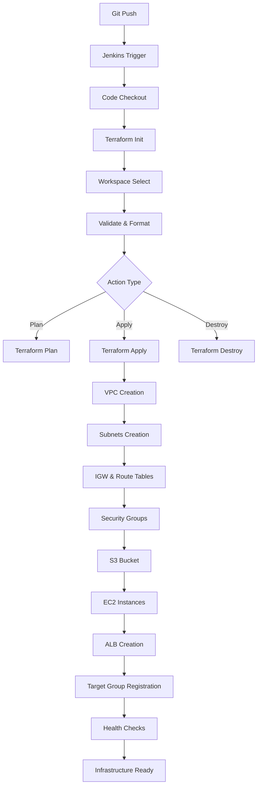
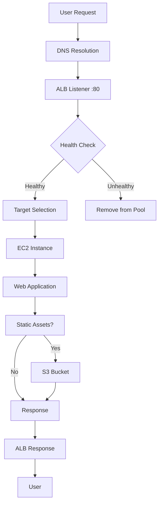
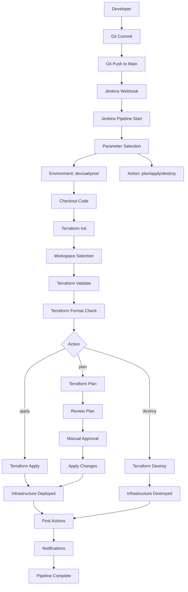

#🚀 Terraform + Jenkins CI/CD Infrastructure (AWS)

## 📌 Overview

This project demonstrates a complete **Infrastructure as Code (IaC) solution** using Terraform and Jenkins CI/CD pipeline to provision and manage AWS cloud infrastructure. The architecture implements a highly available, scalable web application infrastructure with automated deployment capabilities.

The solution follows **Infrastructure as Code** principles, enabling version-controlled, repeatable, and automated infrastructure deployments across multiple environments (dev, uat, prod).

---

## 🧰 Tech Stack

### Core Technologies
* **Terraform** v1.3+ - Infrastructure as Code
* **Jenkins** - CI/CD Automation
* **AWS Provider** v5.0+ - Cloud Infrastructure

### AWS Services
* **EC2** - Virtual Servers
* **VPC** - Virtual Private Cloud
* **ALB** - Application Load Balancer
* **S3** - Object Storage
* **Security Groups** - Network Security
* **Route Tables** - Network Routing
* **Internet Gateway** - Internet Connectivity

### Supporting Tools
* **GitHub** - Version Control
* **DynamoDB** - Terraform State Locking
* **Random Provider** - Resource Naming

---------------------------------------------------------

🔄 1. CI/CD Pipeline Flow (Jenkins + GitHub)
A developer pushes code to GitHub.
This triggers a Jenkins pipeline via webhook.
Jenkins performs:
Code checkout
terraform init (initialize backend with S3 + DynamoDB locking)
Workspace selection (dev / uat / prod)
Validation & formatting checks
Based on selected action:
Plan → shows infrastructure changes
Apply → creates/updates infrastructure
Destroy → removes infrastructure

🏗️ 2. Infrastructure Provisioning Flow (Terraform)

When terraform apply runs, resources are created in this sequence:

VPC → Creates isolated network (10.0.0.0/16)
Subnets → Public + Private across AZs
Internet Gateway + Route Tables → Enables internet access for public subnets
Security Groups → Controls inbound/outbound traffic
S3 Bucket → Stores static assets (private + encrypted)
EC2 Instances → Web servers deployed in multiple AZs
ALB (Application Load Balancer) → Frontend entry point
Target Group → Registers EC2 instances
Health Checks → Ensures only healthy instances serve traffic

➡️ Final state: Highly available infrastructure is ready

🌐 3. Application Data Flow (User Request Flow)
User sends request (browser)
DNS resolves to ALB
ALB receives request on port 80/443
ALB checks instance health:
Healthy → forwards request
Unhealthy → removes instance
Request is routed to one of the EC2 web servers
Application processes request:
If static content → fetch from S3
Else → generate dynamic response
Response goes back:
EC2 → ALB → User
🔐 4. Security & Isolation Flow
Public Subnets → Only ALB exposed to internet
Private Subnets → App layer isolated (no direct access)
Security Groups → Restrict ports (80, 443, 22, 8080)
S3 → Private + encrypted
State Management → Stored securely in S3 with DynamoDB locking

-------------------------------------


## 🏗️ Infrastructure Architecture

### Network Architecture

```
┌─────────────────────────────────────────────────────────────┐
│                    AWS Region (us-east-1)                   │
│  ┌─────────────────────────────────────────────────────────┐ │
│  │                    VPC (10.0.0.0/16)                    │ │
│  │  ┌─────────────────────────────────────────────────────┐ │ │
│  │  │              Public Subnets (AZ-a, AZ-b)            │ │ │
│  │  │  ┌─────────┐    ┌─────────┐    ┌─────────────────┐   │ │ │
│  │  │  │  ALB    │    │  IGW    │    │   Route Table   │   │ │ │
│  │  │  │  (LB)   │◄──►│  (IGW)  │◄──►│   (Public RT)  │   │ │ │
│  │  │  └─────────┘    └─────────┘    └─────────────────┘   │ │ │
│  │  │                                                       │ │ │
│  │  │  ┌─────────┐    ┌─────────┐                          │ │ │
│  │  │  │  EC2-1  │    │  EC2-2  │                          │ │ │
│  │  │  │ (Web)   │    │ (Web)   │                          │ │ │
│  │  │  └─────────┘    └─────────┘                          │ │ │
│  │  └─────────────────────────────────────────────────────┘ │ │
│  │                                                           │ │
│  │              Private Subnets (AZ-a, AZ-b)                │ │
│  │  ┌─────────────────────────────────────────────────────┐ │ │
│  │  │  ┌─────────┐                                        │ │ │
│  │  │  │   S3    │                                        │ │ │
│  │  │  │ (Assets)│                                        │ │ │
│  │  │  └─────────┘                                        │ │ │
│  │  └─────────────────────────────────────────────────────┘ │ │
│  └─────────────────────────────────────────────────────────┘ │
└─────────────────────────────────────────────────────────────┘
```

### Component Details

#### 1. **Virtual Private Cloud (VPC)**
- **CIDR Block**: 10.0.0.0/16
- **Purpose**: Isolated network environment
- **Features**: DNS hostnames enabled, DNS resolution enabled

#### 2. **Subnets**
- **Public Subnets** (2): 10.0.1.0/24, 10.0.2.0/24
  - Deployed across 2 Availability Zones
  - Internet-accessible for ALB and bastion hosts
- **Private Subnets** (2): 10.0.3.0/24, 10.0.4.0/24
  - Isolated subnets for application servers
  - No direct internet access

#### 3. **Internet Gateway (IGW)**
- **Purpose**: Enables internet connectivity for public subnets
- **Attached to**: VPC
- **Routes**: 0.0.0.0/0 → IGW

#### 4. **Route Tables**
- **Public Route Table**: Routes internet traffic through IGW
- **Private Route Table**: Local VPC routing only

#### 5. **Security Groups**
- **ALB Security Group**:
  - Inbound: HTTP (80), HTTPS (443) from 0.0.0.0/0
  - Outbound: All traffic to 0.0.0.0/0
- **EC2 Security Group**:
  - Inbound: HTTP (80), HTTPS (443), SSH (22), Custom (8080)
  - SSH restricted to VPC CIDR in production
  - Outbound: All traffic to 0.0.0.0/0

#### 6. **EC2 Instances**
- **AMI**: Amazon Linux 2 (latest)
- **Instance Type**: t2.micro (configurable)
- **Count**: 2 instances across different AZs
- **Purpose**: Web application servers
- **Auto-scaling ready**: Target group registered

#### 7. **Application Load Balancer (ALB)**
- **Type**: Application Load Balancer
- **Listeners**: HTTP (80), HTTPS (443) - configurable
- **Target Group**: EC2 instances on port 80
- **Health Checks**: HTTP /health endpoint
- **Cross-Zone Load Balancing**: Enabled

#### 8. **S3 Bucket**
- **Purpose**: Static asset storage
- **Naming**: `{project}-{env}-{suffix}-{random}`
- **Versioning**: Enabled
- **Encryption**: Server-side encryption
- **Access**: Private (VPC endpoints recommended)

---

## 🔄 Technical Flow & Data Flow

### Infrastructure Provisioning Flow



### Application Data Flow



### CI/CD Pipeline Flow



---

## 📂 Project Structure

```
terraform-std-code-remote-repo-with-LB-jenkins/
│
├── 📁 terraform-module-alb/           # ALB Module
│   ├── main.tf                        # ALB, Target Group, Listener
│   ├── variables.tf                   # ALB configuration variables
│   └── outputs.tf                     # ALB outputs (DNS, ARN)
│
├── 📁 terraform-module-ec2/           # EC2 Module
│   ├── main.tf                        # EC2 instance configuration
│   ├── variables.tf                   # Instance variables
│   └── outputs.tf                     # Instance outputs
│
├── 📁 terraform-module-s3/            # S3 Module
│   ├── main.tf                        # S3 bucket configuration
│   ├── variables.tf                   # Bucket variables
│   └── outputs.tf                     # Bucket outputs
│
├── 📁 terraform-module-security-group/# Security Group Module
│   ├── main.tf                        # Security group rules
│   ├── variables.tf                   # SG variables
│   └── outputs.tf                     # SG outputs
│
├── 📁 terraform-module-subnet/        # Subnet Module
│   ├── main.tf                        # Subnet creation
│   ├── variables.tf                   # Subnet variables
│   └── outputs.tf                     # Subnet outputs
│
├── 📁 terraform-module-vpc/           # VPC Module
│   ├── main.tf                        # VPC, IGW, Route Tables
│   ├── variables.tf                   # VPC variables
│   └── outputs.tf                     # VPC outputs
│
├── 📁 envs/                           # Environment Configurations
│   ├── dev.tfvars                     # Development environment
│   ├── uat.tfvars                     # UAT environment
│   └── prod.tfvars                    # Production environment
│
├── 📄 main.tf                         # Root configuration
├── 📄 variables.tf                    # Root variables
├── 📄 outputs.tf                      # Root outputs
├── 📄 backend.tf                      # Terraform backend config
├── 📄 Jenkinsfile                     # Jenkins pipeline
├── 📄 README.md                       # This file
└── 📁 Script/                         # Utility scripts
```

---

## ⚙️ Jenkins Pipeline Stages

### Pipeline Parameters
- **ENV**: Environment selection (dev/uat/prod)
- **ACTION**: Terraform action (plan/apply/destroy)
- **BRANCH**: Git branch to deploy (default: main)

### Pipeline Stages

#### 1. **Checkout**
- Clones the GitHub repository
- Checks out specified branch
- Prepares workspace for Terraform

#### 2. **Terraform Init**
- Initializes Terraform with S3 backend
- Configures remote state storage
- Downloads required providers

#### 3. **Workspace Selection**
- Creates/selects Terraform workspace per environment
- Isolates state between environments
- Enables parallel deployments

#### 4. **Validate**
- Validates Terraform configuration syntax
- Checks code formatting
- Ensures configuration correctness

#### 5. **Terraform Action**
- **Plan**: Shows infrastructure changes
- **Apply**: Provisions/updates infrastructure
- **Destroy**: Removes all resources

### Environment Isolation

```hcl
# Each environment gets its own workspace
terraform workspace select dev    # dev.tfstate
terraform workspace select uat    # uat.tfstate
terraform workspace select prod   # prod.tfstate
```

---

## 🔐 Security Considerations

### Network Security
- **Security Groups**: Least privilege access
- **Private Subnets**: Application isolation
- **Public Subnets**: Load balancer access only

### Access Control
- **SSH Access**: Restricted to VPC CIDR in production
- **S3 Buckets**: Private access with VPC endpoints
- **IAM Roles**: Minimal required permissions

### State Management
- **Remote State**: S3 backend with locking
- **Encryption**: Server-side encryption for state files
- **Versioning**: State file versioning enabled

---

## 📊 Outputs & Monitoring

### Terraform Outputs
- **ALB DNS Name**: Load balancer endpoint
- **EC2 Instance IDs**: Server identifiers
- **Public IPs**: Instance public addresses
- **Subnet IDs**: Network segment identifiers
- **VPC ID**: Virtual network identifier
- **S3 Bucket Name**: Storage bucket name

### Health Monitoring
- **ALB Health Checks**: Automatic instance health monitoring
- **Target Group**: Healthy/Unhealthy instance tracking
- **CloudWatch**: Infrastructure monitoring and alerting

---

## 🚀 Deployment Instructions

### Prerequisites
1. **AWS Account** with appropriate permissions
2. **Jenkins Server** with AWS credentials
3. **GitHub Repository** access
4. **Terraform** v1.3+ installed

### Quick Start

#### 1. Configure AWS Credentials
```bash
aws configure
# Enter your AWS Access Key ID, Secret Access Key, and region
```

#### 2. Clone Repository
```bash
git clone https://github.com/amit24sapkal/terraform-std-code-remote-repo-with-LB-jenkins.git
cd terraform-std-code-remote-repo-with-LB-jenkins
```

#### 3. Initialize Terraform
```bash
terraform init
```

#### 4. Plan Deployment (Dev Environment)
```bash
terraform workspace select dev
terraform plan -var-file=envs/dev.tfvars
```

#### 5. Apply Infrastructure
```bash
terraform apply -var-file=envs/dev.tfvars
```

### Jenkins Deployment

1. **Configure Jenkins Job**
   - Create new pipeline job
   - Point to Jenkinsfile in repository
   - Configure webhook for automatic triggers

2. **Run Pipeline**
   - Select environment (dev/uat/prod)
   - Choose action (plan/apply/destroy)
   - Execute pipeline

---

## 🔧 Configuration Management

### Environment Variables
- **TF_VAR_environment**: Set via Jenkins parameters
- **AWS Credentials**: Configured in Jenkins credentials store

### Variable Files
- **dev.tfvars**: Development configuration
- **uat.tfvars**: User Acceptance Testing
- **prod.tfvars**: Production configuration

### Backend Configuration
```hcl
backend "s3" {
  bucket         = "mydev-project-terraform-sample-amit"
  key            = "infra/terraform.tfstate"
  region         = "us-east-1"
  dynamodb_table = "terraform-lock"
}
```

---# terraform-std-code-remote-repo-with-LB-jenkins-mai

# terraform-std-code-remote-repo-with-LB-jenkins-main

# terraform-std-code-remote-repo-with-LB-jenkins-main

